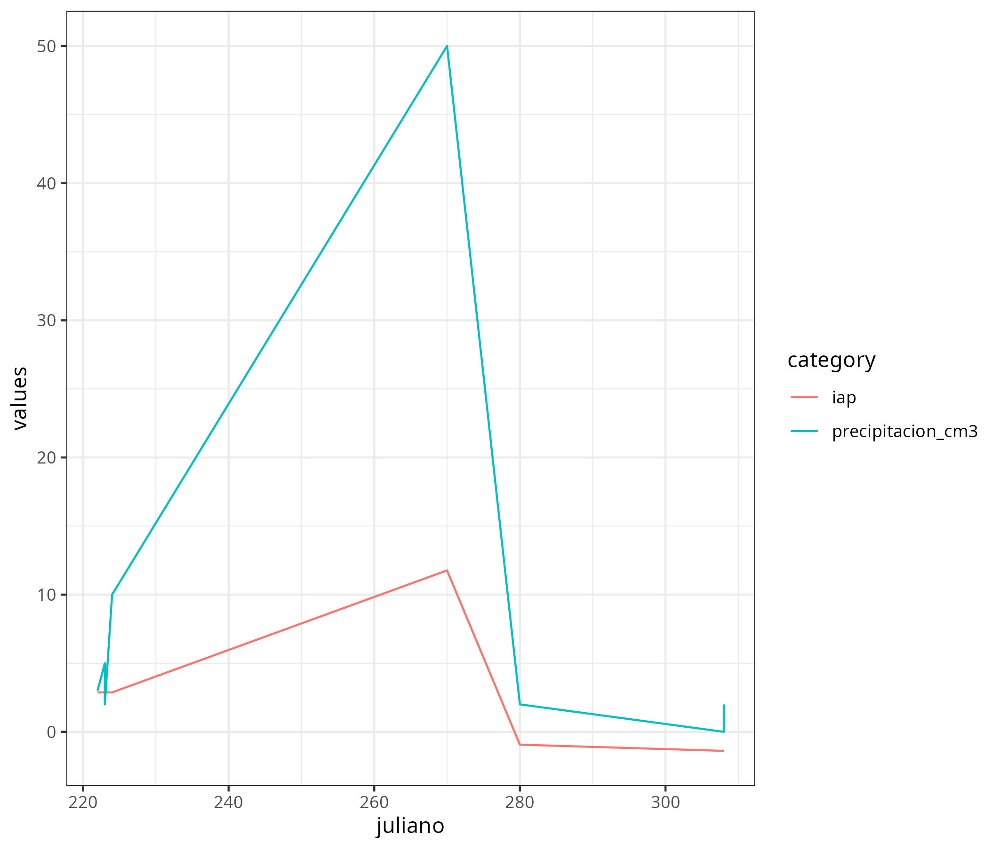

\

## Abstract

Essential biodiversity variables (EBV) have been proposed by GEOBON, representing a minimum set of measurements that can capture major dimensions of biodiversity change as a means to harmonize and structure biodiversity observation efforts. Efforts to date to implement the EBVs have mostly focused on national, regional and global scales with little attention to how EBVs can structure and benefit from local-scale monitoring. Local-scale generation of biodiversity data can lead to a more effective and efficient way to guide conservation and sustainable development. Local communities are on the front-lines of biodiversity conservation where their activities both impact and are supported by biodiversity and ecosystem services. Having the ability to connect well-structured local activities (e.g, subsistence, farming, etc.) to the monitoring of EBVs represents an opportunity to efficiently structure biodiversity monitoring to serve local needs and interests, while allowing connections to the scientific community and to broader monitoring efforts and datasets. Montes de Maria located in the Caribbean region of Colombia has the largest extension of tropical dry forest in the country and is also one of the most threatened ecosystems in the world. In this project, we co-create a biodiversity monitoring scheme in the Colombian Caribbean in the Montes de Maria region, based on the problems and concerns that the community identifies around the tropical dry forest, one of the most threatened ecosystems in the world. The scheme was structured based on the EBVs thinking that the result and trends that these variables take can guide the actions and decisions that the communities can take to improve the state of the ecosystem and reach the future scenarios proposed by themselves at the beginning of the monitoring cycle. Three community associations have been actively participating and collaborating with the Humboldt Institute in the design and implementation of a community-based monitoring scheme in this region [@ArcePlata2020Monitoreo]. This project serves as an example of how to translate a global framework to the local context to ensure a structured and scalable approach to biodiversity monitoring, determine how to ensure EBVs can serve local interests, and promote the consolidation of community monitoring networks.

One potential figure that will be created for one of the indicators will be a time series of the rainfall values with the rainfall anomaly index value [Figure 1](Figure%201).

[{width="444"}](Figure%201)

## References
