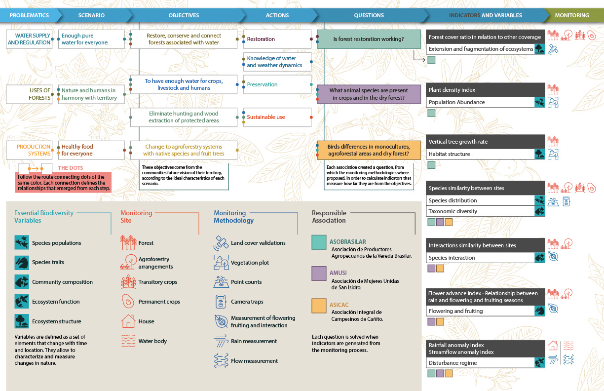

# Study Information

## Title

```{=html}
<!-- Provide the working title of your study. It may be the same title that you submit for publication of your final manuscript, but it is not a requirement. The title should be a specific and informative description of a project. Vague titles such as 'Fruit fly preregistration plan' are not appropriate.

Example: Effect of sugar on brownie tastiness. -->
```
`r rmarkdown::metadata$title`

## Short title

`r rmarkdown::metadata$shorttitle`

## Description

```{=html}
<!-- Please give a brief description of your study, including some background, the purpose of the of the study, or broad research questions. The description should be no longer than the length of an abstract. It can give some context for the proposed study, but great detail is not needed here for your preregistration.

Example: Though there is strong evidence to suggest that sugar affects taste preferences, the effect has never been demonstrated in brownies. Therefore, we will measure taste preference for four different levels of sugar concentration in a standard brownie recipe to determine if the effect exists in this pastry. -->
```
Essential biodiversity variables have been created in order to harmonize monitoring efforts throughout the world. However, they have been mostly applied at global, national and regional scales. By using them at local scales, they can connect these wider range initiatives to more local scales. To keep track of biodiversity changes, monitoring is an important approach to inform about the status and trends of biodiversity. More specifically, community-based monitoring has the potential to connect the needs of the local communities to the importance of preserving biodiversity. The implementation of this tool empowers communities and supports the identification of requirements and conservation actions needed in the territory. A community-based monitoring scheme was proposed to local communities according to their interests and environmental issues identified in the area. They actively participate in projects related to the conservation, restoration or preservation in their territory.

## Hypotheses

```{=html}
<!-- List specific, concise, and testable hypotheses. Please state if the hypotheses are directional or non-directional. If directional, state the direction. A predicted effect is also appropriate here. If a specific interaction or moderation is important to your research, you can list that as a separate hypothesis.

Example: If taste affects preference, then mean preference indices will be higher with higher concentrations of sugar. -->
```
This study is meant to be exploratory, and therefore is not hypothesis driven.

# Design Plan

<!-- In this section, you will be asked to describe the overall design of your study. Remember that this research plan is designed to register a single study, so if you have multiple experimental designs, please complete a separate preregistration. -->

As part of the implementation of a community-based biodiversity monitoring scheme in Montes de María region in Colombia, a set of indicators selected by the communities, that aim to answer three monitoring questions of interests to the three local associations in the area were selected [@ArcePlata2020Monitoreo]. The three questions are:

1.  Is forest restoration working?
2.  What species are there in crops and in dry forests?
3.  Difference between birds in monocultures, agroforestry zones and dry forests?

To calculate these indicators, seven monitoring methodologies were defined from which the members of the three associations will collect the data (Figure 1). Two methodologies associated with the measurement of precipitation and flow were added, because it was of interest to the three associations to know about the water and climate dynamics of their territory.



## Study type

This is an **Observational Study**. Data is collected from study subjects that are not randomly assigned to a treatment.

## Blinding

<!-- Blinding describes who is aware of the experimental manipulations within a study. Select all that apply. Is there any additional blinding in this study? -->

No blinding is involved in this study.

## Study design

```{=html}
<!-- Describe your study design. Examples include two-group, factorial, randomized block, and repeated measures. Is it a between (unpaired), within-subject (paired), or mixed design? Describe any counterbalancing required. Typical study designs for observation studies include cohort, cross sectional, and case-control studies.

This question has a variety of possible answers. The key is for a researcher to be as detailed as is necessary given the specifics of their design. Be careful to determine if every parameter has been specified in the description of the study design. There may be some overlap between this question and the following questions. That is OK, as long as sufficient detail is given in one of the areas to provide all of the requested information. For example, if the study design describes a complete factorial, 2 X 3 design and the treatments and levels are specified previously, you do not have to repeat that information.

Example: We have a between subjects design with 1 factor (sugar by mass) with 4 levels. -->
```
From the seven methodologies proposed. Two have been considered first to be implemented first. :

1.  Point counts (Method 03)
2.  Rain measurement (precipitation) (Method 06)

## Randomization

```{=html}
<!-- If you are doing a randomized study, how will you randomize, and at what level? Typical randomization techniques include: simple, block, stratified, and adaptive covariate randomization. If randomization is required for the study, the method should be specified here, not simply the source of random numbers.

Example: We will use block randomization, where each participant will be randomly assigned to one of the four equally sized, predetermined blocks. The random number list used to create these four blocks will be created using the web applications available at https://random.org. -->
```
This will not be a randomized study.

# Sampling Plan

<!-- In this section we’ll ask you to describe how you plan to collect samples, as well as the number of samples you plan to collect and your rationale for this decision. Please keep in mind that the data described in this section should be the actual data used for analysis, so if you are using a subset of a larger dataset, please describe the subset that will actually be used in your study. -->

A plan for each methodology was established considering the daily activities of the local communities and a frequency is suggested according to the methods generally used.

### Method 03. Point count

For this methodology, birds or mammals observed within a period of 15 minutes in a radius of 25m around a demarcated point such as a tree will be registered.

Ideally, monitoring by counting points should be done weekly (at least twice a month) between 5:00 a.m. and 5:00 p.m. m. to 8:00 a.m. m. and 4:00 p.m. m. to 6:00 p.m. m.

At least ten fixed points must be identified for each cover (forest, monoculture, agroforestry arrangement, permanent crops, pastures, among others).

### Method 06. Rainfall measurement

For this methodology, daily precipitation data in cm3 is taken within a container located in the monitoring area. One point for each local association will be used for this. In total three monitoring points will be established.

It is advised to carry out this monitoring daily at the same time, from which calculations can be made per week and per month. For this reason, it is recommended to locate the point in a place that is visited frequently (i.e. in front the house).

## Existing data

<!-- Preregistration is designed to make clear the distinction between confirmatory tests, specified prior to seeing the data, and exploratory analyses conducted after observing the data. Therefore, creating a research plan in which existing data will be used presents unique challenges. Please select the description that best describes your situation. Please do not hesitate to contact us if you have questions about how to answer this question (prereg@cos.io). -->

**Registration prior to creation of data**. As of the date of submission of this research plan for preregistration, the data have not yet been collected, created, or realized.

## Explanation of existing data

```{=html}
<!-- If you indicate that you will be using some data that already exist in this study, please describe the steps you have taken to assure that you are unaware of any patterns or summary statistics in the data. This may include an explanation of how access to the data has been limited, who has observed the data, or how you have avoided observing any analysis of the specific data you will use in your study.

An appropriate instance of using existing data would be collecting a sample size much larger than is required for the study, using a small portion of it to conduct exploratory analysis, and then registering one particular analysis that showed promising results. After registration, conduct the specified analysis on that part of the dataset that had not been investigated by the researcher up to that point.

Example: An appropriate instance of using existing data would be collecting a sample size much larger than is required for the study, using a small portion of it to conduct exploratory analysis, and then registering one particular analysis that showed promising results. After registration, conduct the specified analysis on that part of the dataset that had not been investigated by the researcher up to that point. -->
```
Pending.

## Data collection procedures

```{=html}
<!-- Please describe the process by which you will collect your data. If you are using human subjects, this should include the population from which you obtain subjects, recruitment efforts, payment for participation, how subjects will be selected for eligibility from the initial pool (e.g. inclusion and exclusion rules), and your study timeline. For studies that donÍt include human subjects, include information about how you will collect samples, duration of data gathering efforts, source or location of samples, or batch numbers you will use.

The answer to this question requires a specific set of instructions so that another person could repeat the data collection procedures and recreate the study population. Alternatively, if the study population would be unable to be reproduced because it relies on a specific set of circumstances unlikely to be recreated (e.g., a community of people from a specific time and location), the criteria and methods for creating the group and the rationale for this unique set of subjects should be clear.

Example: Participants will be recruited through advertisements at local pastry shops. Participants will be paid $10 for agreeing to participate (raised to $30 if our sample size is not reached within 15 days of beginning recruitment). Participants must be at least 18 years old and be able to eat the ingredients of the pastries. -->
```
Due to connection limitations in the area, the data collection will be done in paper forms, but there will be one person in charge to upload these data to a digital version of these forms created with [KoboToolbox](https://kf.kobotoolbox.org/#/library/asset/aVtiZurVT2pCrADg3DdWdY). The information uploaded to these forms can be downloaded to several formats, like csv, xls and others according to the type of data collected.

These data will be loaded to an Amazon Relational Database Service (RDS) where the data will be re-estructured to produce the results to show to the communities.

For the encoding of variables in the KoBoToolBox formats, the name of each question begins with two letters indicating the type of answer:

dt - for dates and times

nm - for numerical values

tx - for text type response

ct - for categorical responses

fl - for attachments

Each monitoring point has a code with the following structure: 01M01V003P001 (Methodology-Municipality-Vereda-Point), through this field the responses corresponding to a particular project can be filtered. A digit for the monitoring point boxes was increased since it was detected that it would quickly reach more than 100, due to methodologies such as flowering and counting points.

Additional data for the monitoring points like coordinates, location and observations will be registered on a form called "Monitoring commitments".

## Sample size

```{=html}
<!-- Describe the sample size of your study. How many units will be analyzed in the study? This could be the number of people, birds, classrooms, plots, interactions, or countries included. If the units are not individuals, then describe the size requirements for each unit. If you are using a clustered or multilevel design, how many units are you collecting at each level of the analysis? For some studies, this will simply be the number of samples or the number of clusters. For others, this could be an expected range, minimum, or maximum number.

Example: Our target sample size is 280 participants. We will attempt to recruit up to 320, assuming that not all will complete the total task. -->
```
Enter your response here.

## Sample size rationale

```{=html}
<!-- This could include a power analysis or an arbitrary constraint such as time, money, or personnel. This gives you an opportunity to specifically state how the sample size will be determined. A wide range of possible answers is acceptable; remember that transparency is more important than principled justifications. If you state any reason for a sample size upfront, it is better than stating no reason and leaving the reader to "fill in the blanks." Acceptable rationales include: a power analysis, an arbitrary number of subjects, or a number based on time or monetary constraints.

Example: We used the software program G*Power to conduct a power analysis. Our goal was to obtain .95 power to detect a medium effect size of .25 at the standard .05 alpha error probability. -->
```
Enter your response here.

## Stopping rule

```{=html}
<!-- If your data collection procedures do not give you full control over your exact sample size, specify how you will decide when to terminate your data collection. 

You may specify a stopping rule based on p-values only in the specific case of sequential analyses with pre-specified checkpoints, alphas levels, and stopping rules. Unacceptable rationales include stopping based on p-values if checkpoints and stopping rules are not specified. If you have control over your sample size, then including a stopping rule is not necessary, though it must be clear in this question or a previous question how an exact sample size is attained.

Example: We will post participant sign-up slots by week on the preceding Friday night, with 20 spots posted per week. We will post 20 new slots each week if, on that Friday night, we are below 320 participants. -->
```
Enter your response here.

# Variables

<!-- In this section you can describe all variables (both manipulated and measured variables) that will later be used in your confirmatory analysis plan. In your analysis plan, you will have the opportunity to describe how each variable will be used. If you have variables which you are measuring for exploratory analyses, you are not required to list them, though you are permitted to do so. -->

## Manipulated variables

```{=html}
<!-- Describe all variables you plan to manipulate and the levels or treatment arms of each variable. This is not applicable to any observational study. For any experimental manipulation, you should give a precise definition of each manipulated variable. This must include a precise description of the levels at which each variable will be set, or a specific definition for each categorical treatment. For example, “loud or quiet,” should instead give either a precise decibel level or a means of recreating each level. 'Presence/absence' or 'positive/negative' is an acceptable description if the variable is precisely described.

Example: We manipulated the percentage of sugar by mass added to brownies. The four levels of this categorical variable are: 15%, 20%, 25%, or 40% cane sugar by mass. -->
```
Enter your response here.

## Measured variables

```{=html}
<!-- Describe each variable that you will measure. This will include outcome measures, as well as any predictors or covariates that you will measure. You do not need to include any variables that you plan on collecting if they are not going to be included in the confirmatory analyses of this study.

Observational studies and meta-analyses will include only measured variables. As with the previous questions, the answers here must be precise. For example, 'intelligence,' 'accuracy,' 'aggression,' and 'color' are too vague. Acceptable alternatives could be 'IQ as measured by Wechsler Adult Intelligence Scale' 'percent correct,' 'number of threat displays,' and 'percent reflectance at 400 nm.'

Example: The single outcome variable will be the perceived tastiness of the single brownie each participant will eat. We will measure this by asking participants ‘How much did you enjoy eating the brownie’ (on a scale of 1-7, 1 being 'not at all', 7 being 'a great deal') and 'How good did the brownie taste' (on a scale of 1-7, 1 being 'very bad', 7 being 'very good'). -->
```
Method 3. Species occurrences, feeding behavior and strata used by monitoring site.

Method 6. Precipitation data in cm^3^.

## Indices

```{=html}
<!-- If any measurements are  going to be combined into an index (or even a mean), what measures will you use and how will they be combined? Include either a formula or a precise description of your method. If your are using a more complicated statistical method to combine measures (e.g. a factor analysis), you can note that here but describe the exact method in the analysis plan section.

If you are using multiple pieces of data to construct a single variable, how will this occur? Both the data that are included and the formula or weights for each measure must be specified. Standard summary statistics, such as "means" do not require a formula, though more complicated indices require either the exact formula or, if it is an established index in the field, the index must be unambiguously defined. For example, "biodiversity index" is too broad, whereas "Shannon’s biodiversity index" is appropriate.

Example: We will take the mean of the two questions above to create a single measure of 'brownie enjoyment.'  -->
```
Method 03. Morisita-Horn similarity index

Method 06. Rainfall anomaly index

# Analysis Plan

```{=html}
<!-- You may describe one or more confirmatory analysis in this preregistration. Please remember that all analyses specified below must be reported in the final article, and any additional analyses must be noted as exploratory or hypothesis generating.

A confirmatory analysis plan must state up front which variables are predictors (independent) and which are the outcomes (dependent), otherwise it is an exploratory analysis. You are allowed to describe any exploratory work here, but a clear confirmatory analysis is required. -->
```
## Statistical models

```{=html}
<!-- What statistical model will you use to test each hypothesis? Please include the type of model (e.g. ANOVA, multiple regression, SEM, etc) and the specification of the model (this includes each variable that will be included as predictors, outcomes, or covariates). Please specify any interactions, subgroup analyses, pairwise or complex contrasts, or follow-up tests from omnibus tests. If you plan on using any positive controls, negative controls, or manipulation checks you may mention that here. Remember that any test not included here must be noted as an exploratory test in your final article.

This is perhaps the most important and most complicated question within the preregistration. As with all of the other questions, the key is to provide a specific recipe for analyzing the collected data. Ask yourself: is enough detail provided to run the same analysis again with the information provided by the user? Be aware for instances where the statistical models appear specific, but actually leave openings for the precise test. See the following examples:

- If someone specifies a 2x3 ANOVA with both factors within subjects, there is still flexibility with the various types of ANOVAs that could be run. Either a repeated measures ANOVA (RMANOVA) or a multivariate ANOVA (MANOVA) could be used for that design, which are two different tests. 
- If you are going to perform a sequential analysis and check after 50, 100, and 150 samples, you must also specify the p-values you’ll test against at those three points.

Example:  We will use a one-way between subjects ANOVA to analyze our results. The manipulated, categorical independent variable is 'sugar' whereas the dependent variable is our taste index. -->
```
No response

## Transformations

```{=html}
<!-- If you plan on transforming, centering, recoding the data, or will require a coding scheme for categorical variables, please describe that process. If any categorical predictors are included in a regression, indicate how those variables will be coded (e.g. dummy coding, summation coding, etc.) and what the reference category will be.

Example: The "Effect of sugar on brownie tastiness" does not require any additional transformations. However, if it were using a regression analysis and each level of sweet had been categorically described (e.g. not sweet, somewhat sweet, sweet, and very sweet), 'sweet' could be dummy coded with 'not sweet' as the reference category. -->
```
No response

## Inference criteria

```{=html}
<!-- What criteria will you use to make inferences? Please describe the information youÍll use (e.g. p-values, bayes factors, specific model fit indices), as well as cut-off criterion, where appropriate. Will you be using one or two tailed tests for each of your analyses? If you are comparing multiple conditions or testing multiple hypotheses, will you account for this?

p-values, confidence intervals, and effect sizes are standard means for making an inference, and any level is acceptable, though some criteria must be specified in this or previous fields. Bayesian analyses should specify a Bayes factor or a credible interval. If you are selecting models, then how will you determine the relative quality of each? In regards to multiple comparisons, this is a question with few "wrong" answers. In other words, transparency is more important than any specific method of controlling the false discovery rate or false error rate. One may state an intention to report all tests conducted or one may conduct a specific correction procedure; either strategy is acceptable.

Example: We will use the standard p<.05 criteria for determining if the ANOVA and the post hoc test suggest that the results are significantly different from those expected if the null hypothesis were correct. The post-hoc Tukey-Kramer test adjusts for multiple comparisons. -->
```
## Data exclusion

```{=html}
<!-- How will you determine what data or samples, if any, to exclude from your analyses? How will outliers be handled? Will you use any awareness check? Any rule for excluding a particular set of data is acceptable. One may describe rules for excluding a participant or for identifying outlier data.

Example: No checks will be performed to determine eligibility for inclusion besides verification that each subject answered each of the three tastiness indices. Outliers will be included in the analysis. -->
```
No response

## Missing data

```{=html}
<!-- How will you deal with incomplete or missing data? Any relevant explanation is acceptable. As a final reminder, remember that the final analysis must follow the specified plan, and deviations must be either strongly justified or included as a separate, exploratory analysis.

Example: If a subject does not complete any of the three indices of tastiness, that subject will not be included in the analysis. -->
```
Pending

## Exploratory analyses (optional)

```{=html}
<!-- If you plan to explore your data set to look for unexpected differences or relationships, you may describe those tests here. An exploratory test is any test where a prediction is not made up front, or there are multiple possible tests that you are going to use. A statistically significant finding in an exploratory test is a great way to form a new confirmatory hypothesis, which could be registered at a later time.

Example: We expect that certain demographic traits may be related to taste preferences. Therefore, we will look for relationships between demographic variables (age, gender, income, and marital status) and the primary outcome measures of taste preferences. -->
```
Outputs from these data have been planned to be of use by the communities, therefore to the moment no complex transformations and processes have been planned in order to have a clear output that they can use for their processes.

# Other

## Other (Optional)

<!-- If there is any additional information that you feel needs to be included in your preregistration, please enter it here. Literature cited, disclosures of any related work such as replications or work that uses the same data, or other context that will be helpful for future readers would be appropriate here. -->

The local communities have agreed to participate on this project and have given the authorization to register the data in order to show them the processed results in a decision support system developed by the Alexander von Humboldt Institute in Colombia, called [Biotablero](http://biotablero.humboldt.org.co/Monitoreo).

# References

## 

```{=tex}
\vspace{-2pc}
\setlength{\parindent}{-0.5in}
\setlength{\leftskip}{-1in}
\setlength{\parskip}{8pt}
```
\noindent
